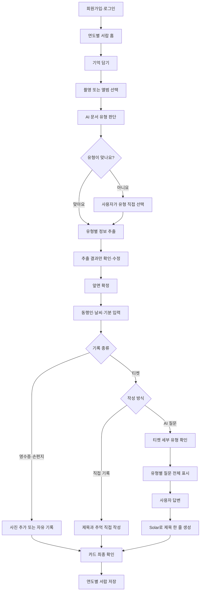

# 🗄️ 기억서랍

> **종이에 남은 순간을, 오래 꺼내볼 수 있는 기억으로.**
> 

기억서랍은 버려지기 쉬운 **영수증·티켓·손편지**를 촬영해 종이에 남은 정보와 그날의 감정을 **앞·뒷면 추억 카드와 연도별 서랍**에 보관하는 모바일 AI 감성 기록 서비스입니다.

가격과 날짜만 저장하는 데서 그치지 않고, 누구와 함께했고 무엇을 느꼈는지 짧게 기록하도록 돕습니다. AI는 사용자의 기억을 만들어내지 않으며, 문서를 읽고 기억을 떠올리는 과정을 보조합니다.

## 현재 개발 범위

이 문서는 해커톤 MVP에서 구현할 **최신 확정 기능과 실제 앱 이용 순서**를 기준으로 작성했습니다.

- 지원 기록: 영수증, 티켓, 손편지
- 핵심 결과물: 유형별 앞·뒷면 추억 카드, 연도별 서랍
- 핵심 AI 흐름: 문서 인식 → 문서 유형 확인 → 유형별 정보 추출 → 사용자 확인 → 선택적 회상 지원
- 제외 범위: 음식·일반 풍경 사진, 영상·음성 기록, 복잡한 배경의 정교한 손글씨 누끼

프론트엔드·백엔드 프레임워크, 데이터베이스, 저장소와 실행 명령은 팀 공통 개발 환경을 확정한 뒤 추가합니다.

---

## 1. 프로젝트 소개

### 1.1 개발 배경

영수증에는 가격과 가게명이, 티켓에는 날짜와 좌석이 남지만 시간이 지나면 그날 함께한 사람과 느꼈던 감정은 쉽게 흐려집니다. 그렇다고 특별한 날마다 긴 일기를 쓰기는 어렵고, 보관해 둔 종이 기록도 분실되거나 훼손되기 쉽습니다.

기억서랍은 이러한 종이 기록을 디지털 카드로 보존하고, 짧은 기록과 선택적인 회상 질문을 통해 종이 뒤에 담긴 관계와 감정까지 함께 남길 수 있도록 합니다.

### 1.2 서비스 대상

| 대상 | 사용 목적 |
| --- | --- |
| 영수증과 티켓을 쉽게 버리지 못하는 사람 | 종이 기록을 훼손 없이 디지털로 보관 |
| 친구·연인·가족과의 추억을 오래 남기고 싶은 청년층 | 함께한 사람과 당시의 감정 기록 |
| 꾸준한 일기는 어렵지만 특별한 날은 남기고 싶은 사람 | 짧은 입력과 선택적인 질문으로 간편하게 기록 |

### 1.3 핵심 가치

- 종이에 남은 **날짜와 장소**를 디지털로 보존합니다.
- 종이만으로는 알 수 없는 **사람과 감정**을 사용자가 직접 채웁니다.
- 모든 기록을 같은 형태로 바꾸지 않고 **영수증·티켓·손편지의 개성**을 살립니다.
- AI가 기억을 대신 작성하지 않고, 사용자가 자신의 기억을 떠올리고 정리하도록 돕습니다.

### 1.4 AI 사용 원칙

- AI가 확신할 수 없는 값은 추측하지 않고 비워둡니다.
- 자동 인식 결과는 사용자가 확인하고 수정한 뒤에만 카드에 반영합니다.
- 동행인·날씨·기분은 AI가 추측하지 않고 사용자가 직접 입력합니다.
- Solar는 사용자의 답변에 없는 사실을 추가하지 않습니다.
- AI가 만든 결과는 항상 사용자가 수정하고 최종 확정할 수 있습니다.

---

## 2. 기억서랍 실제 이용 순서

### 1단계. 회원가입·로그인

`회원가입·로그인 → 연도별 서랍 홈`

- 사용자는 계정을 만들거나 로그인합니다.
- 로그인한 사용자 본인의 추억 카드와 서랍만 조회합니다.
- 홈에서는 최근 연도의 서랍을 가장 위에 표시합니다.
- 새 기록을 추가하려면 `기억 담기` 버튼을 누릅니다.

### 2단계. 사진 촬영 또는 앨범 선택

`기억 담기 → 카메라 촬영 또는 앨범 선택 → 사진 확인`

- 영수증·티켓·손편지를 휴대폰 카메라로 촬영하거나 앨범에서 선택합니다.
- 촬영 결과가 흐리거나 문서가 잘렸다면 다시 촬영할 수 있습니다.
- 사용자가 사진을 확정하면 이미지 방향과 크기를 보정한 뒤 AI 분석을 시작합니다.

### 3단계. AI 문서 유형 판단

`이미지 분석 → 영수증·티켓·손편지 중 하나로 판단 → 사용자 확인`

AI는 업로드한 이미지를 먼저 다음 세 가지 중 하나로 판단합니다.

- 영수증
- 티켓
- 손편지

판단 결과는 원본 사진이 아니라 **해당 문서 모양과 유형명이 담긴 문서 유형 카드**로 보여줍니다.

예시:

> 티켓으로 인식했어요. 맞나요?
> 
> 
> `[티켓 문서 유형 카드]`
> 
- **맞아요:** 확인된 유형에 맞는 정보 추출 단계로 이동합니다.
- **아니에요:** 사용자가 영수증·티켓·손편지 중 올바른 유형을 직접 선택합니다.

이 단계에서는 세부 추출 정보를 아직 보여주지 않고 **문서 유형만 먼저 확정**합니다.

### 4단계. 유형별 정보 추출 및 앞면 확정

문서 유형이 확정되면 해당 유형에 필요한 정보만 추출합니다.

| 문서 유형 | 추출 정보 |
| --- | --- |
| 영수증 | 날짜, 가게명 |
| 티켓 | 날짜, 행사명, 장소, 좌석 |
| 손편지 | 본문 전체 내용 |

추출 결과에는 다음 원칙을 적용합니다.

- AI가 **정확하게 인식한 정보만** 채웁니다.
- 부정확하거나 확신할 수 없는 항목은 임의로 추측하지 않고 비워둡니다.
- 날짜를 찾지 못했을 때 오늘 날짜를 자동으로 넣지 않습니다.
- 확인 화면에는 **원본 이미지를 함께 보여주지 않고 추출 결과만 표시**합니다.
- 사용자는 잘못된 값을 수정하거나 빈칸을 직접 입력할 수 있습니다.

티켓 예시:

```
행사명: 흠뻑쇼
날짜: 2026.07.25
장소: 부산아시아드주경기장
좌석(선택): 직접 입력

이 내용이 모두 맞나요?
```

사용자가 `맞아요`를 누르면 **카드 앞면이 확정**됩니다. 별도의 앞면 정보 편집 단계를 다시 거치지 않습니다.

선택 항목을 입력하지 않았다면 완성된 카드에서는 항목명까지 숨깁니다. 예를 들어 좌석이 비어 있으면 `좌석: -` 또는 `좌석 없음`을 표시하지 않습니다.

### 5단계. 카드 뒷면 공통 정보 작성

모든 기록에서 다음 정보를 사용자가 직접 선택하거나 입력합니다.

- 동행인
- 날씨
- 기분

이 정보는 AI가 이미지나 문서 내용만으로 추측하지 않습니다.

### 6단계. 기록 종류별 뒷면 작성

#### 영수증·손편지

`사진 추가 또는 자유롭게 일기 작성`

- 사용자가 직접 그날의 기억을 기록합니다.
- AI 회상 질문은 사용하지 않습니다.

#### 티켓

다음 두 가지 작성 방식 중 하나를 선택합니다.

- `직접 기록하기`
- `AI 질문으로 떠올리기`

### 7단계. 티켓 기록 작성

#### 직접 기록하기

`제목과 추억 직접 작성 → 내용 확인`

- 사용자가 제목과 추억을 직접 작성합니다.
- 티켓을 `콘서트·공연 / 영화 / 전시`로 추가 분류하지 않습니다.
- 직접 기록할 때 필요하지 않은 분류 단계를 강제로 거치게 하지 않습니다.

#### AI 질문으로 떠올리기

`티켓 세부 유형 확인 → 유형별 질문 전체 표시 → 사용자 답변 → 제목 한 줄 생성`

AI가 티켓 세부 유형을 먼저 추정해 보여주고, 사용자가 확인하거나 변경합니다.

- 콘서트·공연
- 영화
- 전시

세부 유형은 **AI 질문으로 떠올리기**를 선택했을 때만 사용자에게 확인받습니다. 직접 기록하기를 선택하면 세부 유형을 묻지 않습니다.

유형이 확정되면 해당 유형의 질문을 일부만 고르지 않고 **한 화면에 모두 표시**합니다.

#### 질문 은행

| 유형 | 표시할 질문 |
| --- | --- |
| 콘서트·공연 | 가장 벅찼던 순간은 언제였나요?그날 떼창하거나 함성을 질렀던 순간이 있나요?어떤 곡에서 마음이 가장 크게 움직였나요? |
| 영화 | 어떤 계기로 이 영화를 봤나요?가장 마음에 남은 장면이나 대사가 있나요?영화가 끝난 뒤 어떤 이야기를 나눴나요? |
| 전시 | 어떤 계기로 이 전시를 보게 되었나요?가장 마음에 남은 작품은 무엇인가요?관람이 끝난 뒤 어떤 이야기를 나눴나요? |

사용자가 질문에 답변하면 Solar는 답변을 바탕으로 **제목 한 줄만 생성**합니다.

- 별도의 `한 줄 추억`은 생성하지 않습니다.
- 사용자가 작성한 답변은 AI가 다른 내용으로 바꾸지 않습니다.
- 생성된 제목은 사용자가 직접 수정하고 최종 확정할 수 있습니다.
- 사용자 답변에 없는 사실이나 감정을 새로 만들지 않습니다.
- 이미 확인한 날짜와 장소를 다시 묻지 않습니다.

### 8단계. 추억 카드 최종 확인

`카드 앞면·뒷면 미리보기 → 수정 또는 저장`

#### 카드 앞면

- 영수증·티켓·손편지의 원래 종이 형태를 살립니다.
- 사용자가 확인한 정보만 표시합니다.
- 티켓은 원본 이미지에서 추출한 대표 색상을 카드 색상에 반영합니다.
- 손편지는 배경이 단순할 때만 글씨 분리를 시도하고, 결과가 좋지 않으면 원본 이미지를 사용합니다.
- 값이 없는 선택 항목은 항목명도 표시하지 않습니다.

#### 카드 뒷면

- 동행인·날씨·기분을 표시합니다.
- 영수증·손편지는 사용자가 추가한 사진과 자유 기록을 표시합니다.
- 티켓 직접 기록은 사용자가 작성한 제목과 추억을 표시합니다.
- 티켓 AI 질문 기록은 사용자 답변과 사용자가 확정한 제목을 표시합니다.

사용자는 저장 전에 앞면과 뒷면을 모두 확인하고 필요한 단계로 돌아가 수정할 수 있습니다.

### 9단계. 연도별 서랍 저장

`저장 → 실제 추억 날짜 기준으로 해당 연도 서랍에 보관`

- 이미지를 업로드한 날짜가 아니라 **실제 추억 날짜**를 기준으로 저장합니다.
- 최근 연도의 서랍을 가장 위에 표시합니다.
- 하나의 서랍에 해당 연도의 모든 영수증·티켓·손편지 카드를 보관합니다.
- 서랍의 연도는 마스킹테이프 형태로 표시합니다.
- 서랍을 누르면 안의 카드가 실제 종이처럼 자연스럽게 펼쳐집니다.
- 카드를 누르면 화면 중앙에서 크게 보고 앞·뒷면을 넘길 수 있습니다.
- 같은 연도의 다른 기록을 날짜순으로 넘겨볼 수 있습니다.

---

## 3. 전체 사용자 흐름



한 줄로 정리하면 다음과 같습니다.

```
회원가입·로그인
→ 연도별 서랍 홈
→ 기억 담기
→ 촬영 또는 앨범 선택
→ AI 문서 유형 판단
→ 문서 유형 카드 확인
→ 유형별 정보 추출
→ 추출 결과만 확인·수정
→ 앞면 확정
→ 동행인·날씨·기분 입력
→ 유형별 뒷면 작성
→ 카드 최종 확인
→ 연도별 서랍 저장
```

---

## 4. 주요 화면

| 화면 | 핵심 기능 |
| --- | --- |
| 로그인·회원가입 | 계정 생성과 로그인 |
| 연도별 서랍 홈 | 최근 연도부터 서랍 표시, `기억 담기` 진입 |
| 이미지 선택 | 카메라 촬영, 앨범 선택, 다시 촬영 |
| 문서 유형 확인 | AI가 판단한 영수증·티켓·손편지 문서 유형 카드 표시 |
| 문서 유형 직접 선택 | AI 판단이 틀렸을 때 사용자가 올바른 유형 선택 |
| 추출 결과 확인 | 원본 이미지 없이 추출 결과만 표시, 수정·직접 입력 |
| 카드 뒷면 공통 입력 | 동행인·날씨·기분 입력 |
| 자유 기록 | 영수증·손편지의 사진 추가와 일기 작성 |
| 티켓 작성 방식 선택 | 직접 기록하기 또는 AI 질문으로 떠올리기 |
| 티켓 세부 유형 확인 | AI 질문 선택 시에만 콘서트·공연 / 영화 / 전시 확인 |
| 티켓 회상 질문 | 확정된 유형의 질문을 모두 표시하고 답변 입력 |
| AI 제목 확인 | Solar가 만든 제목 한 줄을 수정·확정 |
| 카드 미리보기 | 앞·뒷면 최종 확인, 수정 또는 저장 |
| 서랍·카드 상세 | 연도별 카드 펼쳐보기, 앞·뒷면 확인, 날짜순 이동 |

---

## 5. 시스템 처리 흐름

```
카메라 촬영·앨범 선택
→ 이미지 방향·크기 보정
→ Document Parse로 전체 텍스트와 문서 구조 인식
→ Information Extract와 분류 규칙으로 문서 유형 후보 판단
→ 사용자에게 문서 유형 카드로 확인
→ 확인된 유형의 스키마로 핵심 정보 추출
→ 정확한 값만 표시하고 불확실한 값은 빈칸 처리
→ 사용자가 추출 결과 확인·수정
→ 카드 앞면 확정
→ Canvas/OpenCV로 카드 이미지 처리
→ 사용자가 카드 뒷면 작성
→ 티켓에서 AI 질문을 선택한 경우에만 세부 유형 확인
→ 고정 질문 은행의 해당 유형 질문 전체 표시
→ Solar가 사용자 답변으로 제목 한 줄 생성
→ 사용자 최종 확인
→ 추억 카드와 연도별 서랍 저장
```

### 5.1 기술 사용 위치

| 처리 단계 | 기술 | 역할 |
| --- | --- | --- |
| 이미지 입력 | 모바일 웹, HTML 파일 입력 | 휴대폰 카메라 촬영 또는 앨범 이미지 선택 |
| 이미지 준비 | Browser File API, Canvas API | 이미지 미리보기, 방향·크기 보정 |
| 문서 전체 인식 | Upstage Document Parse | 이미지에서 전체 텍스트·배치·문서 구조 인식 |
| 문서 유형 판단 | Upstage Information Extract, 애플리케이션 분류 규칙 | 영수증·티켓·손편지 중 문서 유형 후보 제안 |
| 핵심 정보 추출 | Upstage Information Extract | 확인된 유형에 필요한 날짜·가게명·행사명·장소·좌석·본문 구조화 |
| 카드 이미지 처리 | Canvas API 또는 OpenCV | 티켓 대표 색상 추출, 단순한 손편지 배경 제거 |
| 회상 결과 정리 | Upstage Solar LLM | 티켓 질문 답변만을 바탕으로 제목 한 줄 생성 |
| 저장·조회 | 백엔드, 데이터베이스, 이미지 저장소 | 사용자별 이미지·카드·연도별 서랍 저장 및 조회 |

Upstage API 키는 프론트엔드에 포함하지 않고 백엔드에서 관리합니다. 외부 AI API에는 서비스 동작에 필요한 정보만 전달합니다.

### 5.2 사용자 검증 상태

AI 결과와 사용자가 확정한 값을 구분하기 위해 다음 상태를 기준으로 처리합니다.

```
이미지 업로드
→ 문서 유형 후보 생성
→ 문서 유형 사용자 확정
→ 유형별 필드 추출
→ 추출 필드 사용자 확정
→ 카드 초안 생성
→ 최종 확인
→ 저장 완료
```

- 사용자가 문서 유형을 확정하기 전에는 유형별 결과를 최종값으로 저장하지 않습니다.
- 사용자가 추출 필드를 확정하기 전에는 카드 앞면을 완성하지 않습니다.
- 서랍과 카드 상세에는 AI 최초 추출값이 아니라 **사용자가 확인한 최종값만** 표시합니다.

---

## 6. 기록 유형별 최종 결과

| 구분 | 앞면 | 뒷면 | AI 회상 질문 |
| --- | --- | --- | --- |
| 영수증 | 원본 형태, 날짜, 가게명 | 동행인·날씨·기분, 사진 또는 자유 기록 | 사용하지 않음 |
| 티켓 | 원본 형태, 날짜, 행사명, 장소, 입력된 경우에만 좌석, 대표 색상 | 동행인·날씨·기분, 직접 기록 또는 질문 답변과 제목 | 사용자 선택 |
| 손편지 | OCR 본문, 단순 배경 제거 결과 또는 원본 이미지 | 동행인·날씨·기분, 사진 또는 자유 기록 | 사용하지 않음 |

---

## 7. 예외 처리

| 상황 | 처리 방식 |
| --- | --- |
| 문서 유형을 잘못 판단함 | 사용자가 영수증·티켓·손편지 중 올바른 유형을 직접 선택 |
| 글자가 흐리거나 문서가 잘림 | 다시 촬영하거나 다른 이미지 선택 안내 |
| 필드 인식이 불확실함 | 추측하지 않고 빈칸으로 표시 |
| 사용자가 선택 필드를 비워둠 | 최종 카드에서 값과 항목명을 모두 숨김 |
| 티켓 세부 유형 판단이 틀림 | AI 질문 화면에서 사용자가 유형 변경 |
| 손편지 배경 제거 품질이 낮음 | 배경 제거 결과를 사용하지 않고 원본 이미지 사용 |
| Solar 제목 생성 실패 | 사용자 답변은 보존하고 제목을 직접 입력하도록 안내 |

---

## 8. 인간다움

기억서랍에서 AI는 기억의 주인이 아닙니다.

AI는 종이에서 날짜·장소·글자를 찾아 입력 부담을 줄이고, 사용자가 선택했을 때만 질문과 제목 정리를 돕습니다. 누구와 함께했는지, 어떤 순간이 마음에 남았는지, 그날 무엇을 느꼈는지는 사용자가 직접 기록합니다.

> **AI가 사실을 꺼내고, 사람이 감정을 채웁니다.**
> 

기억서랍은 효율적으로 기록하는 서비스에 그치지 않고, 버려질 종이 안에 남아 있던 관계와 감정을 다시 꺼내 오래 보관하도록 돕는 서비스입니다.

---

## 9. 기대 효과

- 쉽게 버려지거나 훼손되는 종이 기록을 디지털 추억으로 보존할 수 있습니다.
- 긴 일기를 쓰지 않아도 특별한 날의 사람과 감정을 짧게 기록할 수 있습니다.
- 두 차례의 사용자 확인을 통해 문서 유형과 추출 정보의 오류를 줄일 수 있습니다.
- AI가 기억을 대신 만드는 것이 아니라 사용자의 회상과 정리를 돕습니다.
- 날짜와 가격 중심의 기록을 관계와 감정 중심의 기록으로 확장합니다.
- 원본 종이의 형태와 색감을 살려 아날로그 기록의 감성을 디지털에서도 유지합니다.

---

## 10. 개발 환경

### Frontend

- React
- JavaScript
- 개발 도구: Codex

### Backend

- Java 21
- Spring Boot 3.5.x
- Gradle Wrapper
- MySQL 8.4
- API 테스트: Postman
- 개발 도구: Codex

> 백엔드 팀원은 각자 Java 21을 설치하고 정상적으로 실행되는지 확인합니다.
> 

### AI API

기억서랍의 핵심 기능에서 다음 Upstage API를 사용합니다.

- Document Parse: 영수증·티켓·손편지 이미지의 전체 텍스트와 문서 구조를 인식합니다. 손편지는 인식된 전체 본문을 카드에 활용합니다.
- Information Extract: 영수증의 날짜·가게명과 티켓의 날짜·행사명·장소·좌석을 구조화된 데이터로 추출합니다.
- Solar: Document Parse 결과를 바탕으로 문서 유형을 판단하고, AI 질문 기능을 선택한 티켓의 세부 유형을 추정합니다. 또한 미리 정해진 질문에 대한 사용자 답변만 바탕으로 수정 가능한 제목 한 줄을 생성합니다.

티켓의 회상 질문은 유형별로 미리 정의하며, Solar가 질문이나 별도의 한 줄 추억을 새로 생성하지 않습니다.

Upstage API는 Spring Boot 백엔드에서 호출합니다. API 키는 `UPSTAGE_API_KEY` 환경 변수로 관리하며 코드나 GitHub 저장소에 포함하지 않습니다. 프론트엔드는 Upstage API를 직접 호출하지 않고 백엔드 API를 통해 분석 결과를 전달받습니다.