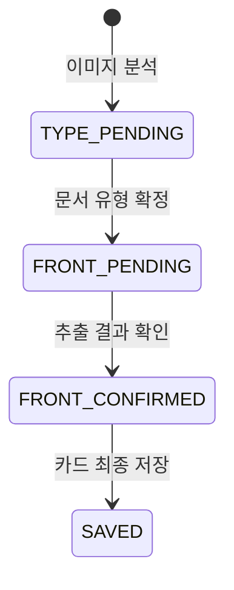

# 기억서랍 API 명세서

> Base URL: `http://localhost:8080/api`
>
> 기본 형식: `application/json; charset=UTF-8`
>
> 이미지 포함 요청: `multipart/form-data`
>
> 인증: `Authorization: Bearer {accessToken}`

이 문서는 기억서랍의 최신 `README.md`와 확정된 실제 앱 이용 순서만을 기준으로 작성한 해커톤 MVP용 API 명세입니다.

API는 사용자의 확인 순서를 다음과 같이 보장합니다.

```text
이미지 업로드
→ AI 문서 유형 후보 확인
→ 확정된 유형에 맞는 정보 추출
→ 추출 결과 확인·수정
→ 카드 앞면 확정
→ 카드 뒷면 작성
→ 카드 최종 저장
```

외부 Upstage API는 백엔드에서만 호출합니다. 프론트엔드는 Document Parse, Information Extract, Solar를 직접 호출하지 않습니다.

---

## 1. API 목록

| 번호 | Method | Endpoint | 기능 | 인증 |
|---:|---|---|---|---|
| 1 | `POST` | `/auth/signup` | 회원가입 | 불필요 |
| 2 | `POST` | `/auth/login` | 로그인 | 불필요 |
| 3 | `POST` | `/memory-drafts/analyze` | 이미지 업로드 및 문서 유형 후보 생성 | 필요 |
| 4 | `POST` | `/memory-drafts/{draftId}/document-type/confirm` | 문서 유형 확정 및 유형별 정보 추출 | 필요 |
| 5 | `PUT` | `/memory-drafts/{draftId}/front/confirm` | 수정된 추출값 확인 및 카드 앞면 확정 | 필요 |
| 6 | `POST` | `/memory-drafts/{draftId}/ticket-recall/questions` | 확정한 티켓 세부 유형의 질문 전체 조회 | 필요 |
| 7 | `POST` | `/memory-drafts/{draftId}/ticket-recall/title` | 답변을 바탕으로 제목 한 줄 생성 | 필요 |
| 8 | `POST` | `/cards` | 카드 뒷면과 함께 최종 카드 저장 | 필요 |
| 9 | `GET` | `/drawers` | 연도별 서랍 목록 조회 | 필요 |
| 10 | `GET` | `/drawers/{year}/cards` | 특정 연도의 카드 목록 조회 | 필요 |
| 11 | `GET` | `/cards/{cardId}` | 카드 앞·뒷면 상세 조회 | 필요 |

README에 없는 로그아웃, 내 정보, 카드 저장 후 수정·삭제, 검색, 공유 API는 포함하지 않습니다.

---

## 2. 공통 규칙

### 2.1 성공 응답

```json
{
  "success": true,
  "message": "요청이 완료되었습니다.",
  "data": {}
}
```

### 2.2 실패 응답

```json
{
  "success": false,
  "code": "VALIDATION_001",
  "message": "요청값을 확인해주세요.",
  "data": null
}
```

### 2.3 인증 헤더

회원가입과 로그인을 제외한 모든 요청에 다음 헤더를 포함합니다.

```http
Authorization: Bearer {accessToken}
```

### 2.4 날짜와 식별자

| 항목 | 형식 | 예시 |
|---|---|---|
| 실제 추억 날짜 | `YYYY-MM-DD` | `2026-07-25` |
| 생성 시각 | ISO 8601 | `2026-07-28T21:30:00+09:00` |
| 식별자 | UUID 문자열 | `9bb06555-85de-46e2-b44e-8f67eb8e08d2` |

- 카드가 들어갈 서랍 연도는 `memoryDate`에서 계산합니다.
- AI가 날짜를 찾지 못해도 오늘 날짜를 자동 입력하지 않습니다.
- 손편지는 날짜를 자동 추출하지 않으므로 사용자가 직접 입력합니다.

### 2.5 `null`, 빈 문자열, 빈 배열

- AI가 확신할 수 없는 값은 추측하지 않고 `null`로 반환합니다.
- 문자열을 입력하지 않은 경우 `""` 대신 `null`을 사용합니다.
- 목록 결과가 없으면 `404`가 아니라 빈 배열 `[]`을 반환합니다.
- 좌석처럼 선택 항목이 `null`이면 최종 카드 UI에서 값뿐 아니라 `좌석`이라는 항목명도 표시하지 않습니다.

### 2.6 공통 enum

#### 문서 유형 `documentType`

| 값 | 의미 |
|---|---|
| `RECEIPT` | 영수증 |
| `TICKET` | 티켓 |
| `LETTER` | 손편지 |

#### 티켓 세부 유형 `ticketSubtype`

| 값 | 의미 |
|---|---|
| `CONCERT_PERFORMANCE` | 콘서트·공연 |
| `MOVIE` | 영화 |
| `EXHIBITION` | 전시 |

티켓 세부 유형은 사용자가 `AI 질문으로 떠올리기`를 선택한 경우에만 화면에 표시합니다. `직접 기록하기`에서는 묻거나 저장하지 않습니다.

#### 티켓 작성 방식 `writingMode`

| 값 | 의미 |
|---|---|
| `DIRECT` | 제목과 추억을 직접 작성 |
| `AI_RECALL` | 유형별 질문에 답하고 AI 제목 사용 |

#### 손편지 앞면 이미지 방식 `frontImageMode`

| 값 | 의미 |
|---|---|
| `ORIGINAL` | 원본 이미지 사용 |
| `BACKGROUND_REMOVED` | 단순 배경 제거 결과 사용 |

#### 임시 기록 상태 `draftStatus`

| 값 | 의미 |
|---|---|
| `TYPE_PENDING` | AI가 제안한 문서 유형을 사용자가 확인하기 전 |
| `FRONT_PENDING` | 문서 유형은 확정됐지만 추출 결과를 확인하기 전 |
| `FRONT_CONFIRMED` | 사용자가 수정된 추출값을 확인해 앞면이 확정됨 |
| `SAVED` | 최종 카드가 저장됨 |

### 2.7 사용자 소유권

- 모든 임시 기록과 카드는 로그인 사용자에게 귀속됩니다.
- 다른 사용자의 `draftId` 또는 `cardId`로 접근하면 `403 Forbidden`을 반환합니다.
- 백엔드는 요청 본문의 사용자 ID를 신뢰하지 않고 인증 토큰의 사용자 ID를 사용합니다.

---

## 3. 임시 기록 처리 방식

이미지는 처음 분석할 때 한 번만 업로드합니다. 백엔드는 이미지와 분석 중간 결과를 `draftId`에 연결해 임시 보관하고, 최종 카드 저장 시 해당 임시 기록을 사용합니다.



- 문서 유형을 바꾸면 해당 유형의 스키마로 정보를 다시 추출합니다.
- 사용자는 최종 저장 전까지 앞면 확인 API를 다시 호출해 값을 수정할 수 있습니다.
- `SAVED` 상태의 임시 기록으로 카드를 중복 생성할 수 없습니다.
- 임시 기록 보관 시간은 아직 정하지 않았으므로 공통 TODO에 남깁니다.

---

## 4. 인증 API

### 4.1 회원가입

`POST /auth/signup`

#### Request

```json
{
  "email": "memory@example.com",
  "password": "password123!"
}
```

| 필드 | 타입 | 필수 | 설명 |
|---|---|---:|---|
| `email` | String | O | 로그인에 사용할 이메일 |
| `password` | String | O | 비밀번호 |

#### Response

`201 Created`

```json
{
  "success": true,
  "message": "회원가입이 완료되었습니다.",
  "data": {
    "userId": "3de81bcd-7939-4a70-b71b-bb205e12ed63",
    "email": "memory@example.com"
  }
}
```

#### 주요 오류

| HTTP | 코드 | 상황 |
|---:|---|---|
| 400 | `VALIDATION_001` | 이메일 또는 비밀번호 형식 오류 |
| 409 | `AUTH_003` | 이미 사용 중인 이메일 |

> TODO: 비밀번호 길이·조합 규칙을 팀에서 확정해야 합니다.

### 4.2 로그인

`POST /auth/login`

#### Request

```json
{
  "email": "memory@example.com",
  "password": "password123!"
}
```

#### Response

`200 OK`

```json
{
  "success": true,
  "message": "로그인되었습니다.",
  "data": {
    "userId": "3de81bcd-7939-4a70-b71b-bb205e12ed63",
    "accessToken": "<JWT_ACCESS_TOKEN>",
    "tokenType": "Bearer",
    "expiresIn": 3600
  }
}
```

#### 주요 오류

| HTTP | 코드 | 상황 |
|---:|---|---|
| 401 | `AUTH_002` | 이메일 또는 비밀번호 불일치 |

---

## 5. 문서 분석 및 카드 앞면 API

### 5.1 이미지 분석 및 문서 유형 후보 생성

`POST /memory-drafts/analyze`

사용자가 촬영하거나 앨범에서 선택한 이미지를 업로드합니다. 백엔드는 Document Parse와 Information Extract를 이용해 문서 유형 후보를 만들지만, 이 응답에서는 유형별 추출 정보를 아직 보여주지 않습니다.

#### Content-Type

`multipart/form-data`

#### Request Parts

| 파트 | 타입 | 필수 | 설명 |
|---|---|---:|---|
| `image` | File | O | 프론트엔드에서 방향과 크기를 보정한 문서 이미지 |

#### Response — 티켓으로 판단한 경우

`200 OK`

```json
{
  "success": true,
  "message": "문서 유형을 분석했습니다.",
  "data": {
    "draftId": "9bb06555-85de-46e2-b44e-8f67eb8e08d2",
    "suggestedDocumentType": "TICKET",
    "typeCard": {
      "type": "TICKET",
      "label": "티켓"
    },
    "requiresManualSelection": false,
    "draftStatus": "TYPE_PENDING",
    "nextAction": "CONFIRM_DOCUMENT_TYPE"
  }
}
```

`typeCard`는 프론트엔드가 영수증·티켓·손편지 프레임을 선택하기 위한 데이터입니다. API가 프레임 이미지 파일을 반환하는 것은 아닙니다.

#### Response — 유형을 확신할 수 없는 경우

`200 OK`

```json
{
  "success": true,
  "message": "문서 유형을 직접 선택해주세요.",
  "data": {
    "draftId": "9bb06555-85de-46e2-b44e-8f67eb8e08d2",
    "suggestedDocumentType": null,
    "typeCard": null,
    "requiresManualSelection": true,
    "draftStatus": "TYPE_PENDING",
    "nextAction": "SELECT_DOCUMENT_TYPE"
  }
}
```

이 경우 프론트엔드는 영수증·티켓·손편지 선택지를 보여줍니다.

#### 이 API에서 반환하지 않는 값

- 날짜, 가게명, 행사명, 장소, 좌석, 손편지 본문
- 원본 이미지 URL
- 티켓 세부 유형

따라서 프론트엔드는 이 단계에서 문서 유형 카드만 보여주고 추출 결과 화면으로 먼저 넘어가지 않습니다.

#### 주요 오류

| HTTP | 코드 | 상황 |
|---:|---|---|
| 400 | `IMAGE_001` | 이미지 파일이 없음 |
| 413 | `IMAGE_002` | 이미지 용량 제한 초과 |
| 415 | `IMAGE_003` | 지원하지 않는 이미지 형식 |
| 422 | `DOCUMENT_001` | 흐림·잘림 등으로 문서 내용을 분석할 수 없음 |
| 503 | `AI_001` | 문서 분석 서비스 일시 오류 |

### 5.2 문서 유형 확정 및 유형별 정보 추출

`POST /memory-drafts/{draftId}/document-type/confirm`

AI의 판단이 맞으면 제안된 유형을, 틀리면 사용자가 직접 선택한 유형을 전송합니다. 백엔드는 확정된 유형의 스키마에 맞는 정보만 반환합니다.

#### Path Parameter

| 변수 | 타입 | 설명 |
|---|---|---|
| `draftId` | UUID | 이미지 분석 API에서 받은 임시 기록 ID |

#### Request

```json
{
  "documentType": "TICKET"
}
```

#### 기록 유형별 앞면 필드

| 기록 유형 | 필드 | AI 처리 |
|---|---|---|
| 영수증 | `memoryDate`, `storeName` | 확신할 수 있는 값만 입력 |
| 티켓 | `memoryDate`, `eventName`, `venue`, `seat` | 확신할 수 있는 값만 입력 |
| 손편지 | `ocrText` | 본문 전체 OCR |
| 손편지 공통 날짜 | `memoryDate` | 자동 추출하지 않고 `null` 반환 |

#### Response — 티켓 예시

`200 OK`

```json
{
  "success": true,
  "message": "티켓 정보를 추출했습니다.",
  "data": {
    "draftId": "9bb06555-85de-46e2-b44e-8f67eb8e08d2",
    "documentType": "TICKET",
    "frontCandidate": {
      "memoryDate": "2026-07-25",
      "eventName": "흠뻑쇼",
      "venue": "부산아시아드주경기장",
      "seat": null
    },
    "emptyFields": [
      "seat"
    ],
    "draftStatus": "FRONT_PENDING",
    "nextAction": "CONFIRM_FRONT"
  }
}
```

#### Response — 손편지 예시

```json
{
  "success": true,
  "message": "손편지 내용을 추출했습니다.",
  "data": {
    "draftId": "9bb06555-85de-46e2-b44e-8f67eb8e08d2",
    "documentType": "LETTER",
    "frontCandidate": {
      "memoryDate": null,
      "ocrText": "오늘 함께해 줘서 정말 고마워."
    },
    "emptyFields": [
      "memoryDate"
    ],
    "draftStatus": "FRONT_PENDING",
    "nextAction": "CONFIRM_FRONT"
  }
}
```

#### 화면 처리 원칙

- 응답에는 추출 결과만 포함하고 `originalImageUrl`을 포함하지 않습니다.
- 프론트엔드는 추출 결과 확인 화면에 원본 이미지를 함께 표시하지 않습니다.
- `null` 필드는 빈 입력칸으로 보여주며 AI가 만든 추정값으로 채우지 않습니다.
- 사용자는 값이 틀리면 수정하고 빈칸은 직접 입력할 수 있습니다.

#### 주요 오류

| HTTP | 코드 | 상황 |
|---:|---|---|
| 400 | `DOCUMENT_002` | 지원하지 않는 문서 유형 |
| 404 | `DRAFT_001` | 임시 기록을 찾을 수 없음 |
| 409 | `DRAFT_002` | 현재 단계에서 유형을 확정할 수 없음 |
| 503 | `AI_001` | 정보 추출 서비스 일시 오류 |

### 5.3 수정된 추출값 확인 및 카드 앞면 확정

`PUT /memory-drafts/{draftId}/front/confirm`

프론트엔드는 AI가 추출한 최초 값이 아니라 사용자가 확인·수정한 최종값을 전송합니다. 이 요청이 성공해야 카드 앞면이 확정됩니다.

#### 영수증 Request

```json
{
  "memoryDate": "2026-07-25",
  "front": {
    "storeName": "서면카페"
  }
}
```

#### 티켓 Request

```json
{
  "memoryDate": "2026-07-25",
  "front": {
    "eventName": "흠뻑쇼",
    "venue": "부산아시아드주경기장",
    "seat": null
  }
}
```

#### 손편지 Request

```json
{
  "memoryDate": "2026-03-18",
  "front": {
    "ocrText": "오늘 함께해 줘서 정말 고마워."
  }
}
```

#### 유형별 검증

| 기록 유형 | 필수 | 선택 |
|---|---|---|
| 영수증 | `memoryDate`, `front.storeName` | 없음 |
| 티켓 | `memoryDate`, `front.eventName`, `front.venue` | `front.seat` |
| 손편지 | `memoryDate`, `front.ocrText` | 없음 |

좌석이 `null`이면 정상 요청으로 처리하며 완성 카드에서는 좌석 항목명까지 숨깁니다.

#### Response — 티켓 예시

`200 OK`

```json
{
  "success": true,
  "message": "카드 앞면이 확정되었습니다.",
  "data": {
    "draftId": "9bb06555-85de-46e2-b44e-8f67eb8e08d2",
    "documentType": "TICKET",
    "memoryDate": "2026-07-25",
    "front": {
      "eventName": "흠뻑쇼",
      "venue": "부산아시아드주경기장",
      "seat": null,
      "representativeColor": "#3478C9"
    },
    "suggestedTicketSubtype": "CONCERT_PERFORMANCE",
    "draftStatus": "FRONT_CONFIRMED",
    "nextAction": "WRITE_BACK"
  }
}
```

- `representativeColor`는 원본 티켓 이미지에서 추출한 카드 기본 색상입니다.
- `suggestedTicketSubtype`는 백엔드가 내부적으로 만든 후보입니다. 프론트엔드는 이 값을 앞면 확인 화면에서 보여주지 않고, 사용자가 `AI 질문으로 떠올리기`를 선택했을 때만 보여줍니다.

#### Response — 손편지 이미지 처리 예시

```json
{
  "success": true,
  "message": "카드 앞면이 확정되었습니다.",
  "data": {
    "draftId": "9bb06555-85de-46e2-b44e-8f67eb8e08d2",
    "documentType": "LETTER",
    "memoryDate": "2026-03-18",
    "front": {
      "ocrText": "오늘 함께해 줘서 정말 고마워.",
      "frontImageMode": "BACKGROUND_REMOVED"
    },
    "draftStatus": "FRONT_CONFIRMED",
    "nextAction": "WRITE_BACK"
  }
}
```

배경 제거 결과의 품질이 낮으면 백엔드는 `frontImageMode`를 `ORIGINAL`로 반환합니다.

#### 주요 오류

| HTTP | 코드 | 상황 |
|---:|---|---|
| 400 | `VALIDATION_001` | 유형별 필수값 누락 또는 날짜 형식 오류 |
| 404 | `DRAFT_001` | 임시 기록을 찾을 수 없음 |
| 409 | `DRAFT_002` | 문서 유형을 확정하지 않은 상태 |

---

## 6. 티켓 AI 회상 API

이 API는 다음 조건을 모두 만족할 때만 사용합니다.

- `documentType`이 `TICKET`
- 카드 앞면이 `FRONT_CONFIRMED`
- 사용자가 `AI 질문으로 떠올리기`를 선택함

사용자가 `직접 기록하기`를 선택하면 이 절의 API를 호출하지 않습니다.

### 6.1 확정한 티켓 유형의 질문 전체 조회

`POST /memory-drafts/{draftId}/ticket-recall/questions`

프론트엔드는 앞면 확정 응답의 `suggestedTicketSubtype`를 AI 질문 화면에서 보여줍니다. 사용자가 맞다고 확인하거나 다른 유형으로 바꾼 뒤 최종 유형을 요청에 담습니다.

#### Request

```json
{
  "ticketSubtype": "CONCERT_PERFORMANCE"
}
```

#### Response

`200 OK`

```json
{
  "success": true,
  "message": "회상 질문을 조회했습니다.",
  "data": {
    "ticketSubtype": "CONCERT_PERFORMANCE",
    "questions": [
      {
        "questionId": "CONCERT_PERFORMANCE_1",
        "order": 1,
        "text": "가장 벅찼던 순간은 언제였나요?"
      },
      {
        "questionId": "CONCERT_PERFORMANCE_2",
        "order": 2,
        "text": "그날 떼창하거나 함성을 질렀던 순간이 있나요?"
      },
      {
        "questionId": "CONCERT_PERFORMANCE_3",
        "order": 3,
        "text": "어떤 곡에서 마음이 가장 크게 움직였나요?"
      }
    ]
  }
}
```

이 API는 질문을 두 개만 선택하지 않습니다. 확정된 유형의 질문 세 개를 모두, 정해진 순서대로 반환합니다.

#### 질문 은행

| 티켓 세부 유형 | 질문 |
|---|---|
| `CONCERT_PERFORMANCE` | 가장 벅찼던 순간은 언제였나요?<br>그날 떼창하거나 함성을 질렀던 순간이 있나요?<br>어떤 곡에서 마음이 가장 크게 움직였나요? |
| `MOVIE` | 어떤 계기로 이 영화를 봤나요?<br>가장 마음에 남은 장면이나 대사가 있나요?<br>영화가 끝난 뒤 어떤 이야기를 나눴나요? |
| `EXHIBITION` | 어떤 계기로 이 전시를 보게 되었나요?<br>가장 마음에 남은 작품은 무엇인가요?<br>관람이 끝난 뒤 어떤 이야기를 나눴나요? |

질문은 고정 질문 은행에서 가져오므로 이 API에서는 Solar를 호출하지 않습니다.

#### 주요 오류

| HTTP | 코드 | 상황 |
|---:|---|---|
| 400 | `TICKET_001` | 지원하지 않는 티켓 세부 유형 |
| 404 | `DRAFT_001` | 임시 기록을 찾을 수 없음 |
| 409 | `TICKET_002` | 티켓이 아니거나 앞면이 확정되지 않음 |

### 6.2 답변을 바탕으로 제목 한 줄 생성

`POST /memory-drafts/{draftId}/ticket-recall/title`

Solar는 사용자의 답변만을 바탕으로 제목 한 줄을 생성합니다.

#### Request

```json
{
  "ticketSubtype": "CONCERT_PERFORMANCE",
  "answers": [
    {
      "questionId": "CONCERT_PERFORMANCE_1",
      "question": "가장 벅찼던 순간은 언제였나요?",
      "answer": "마지막 곡을 모두 함께 부르던 순간이 가장 벅찼어요."
    },
    {
      "questionId": "CONCERT_PERFORMANCE_2",
      "question": "그날 떼창하거나 함성을 질렀던 순간이 있나요?",
      "answer": "앙코르 때 다 같이 떼창했어요."
    },
    {
      "questionId": "CONCERT_PERFORMANCE_3",
      "question": "어떤 곡에서 마음이 가장 크게 움직였나요?",
      "answer": "마지막 앙코르곡이 가장 기억에 남아요."
    }
  ]
}
```

| 필드 | 타입 | 필수 | 설명 |
|---|---|---:|---|
| `ticketSubtype` | String | O | 사용자가 최종 확인한 세부 유형 |
| `answers` | Array | O | 화면에 표시한 질문과 사용자 답변 |
| `answers[].questionId` | String | O | 질문 은행의 질문 ID |
| `answers[].question` | String | O | 사용자에게 실제로 보여준 질문 |
| `answers[].answer` | String | 조건부 | 하나 이상의 답변은 비어 있지 않아야 함 |

#### Response

`200 OK`

```json
{
  "success": true,
  "message": "제목을 생성했습니다.",
  "data": {
    "titleCandidate": "함께 부른 마지막 앙코르"
  }
}
```

#### 생성 규칙

- `titleCandidate` 한 줄만 반환합니다.
- `oneLineMemoryCandidate`, `memoryTextCandidate` 등 별도의 한 줄 추억은 생성하지 않습니다.
- 사용자 답변에 없는 사실·인물·감정을 추가하지 않습니다.
- 답변의 의미를 바꾸거나 감정을 과장하지 않습니다.
- 날짜와 장소를 다시 질문하지 않습니다.
- 프론트엔드는 생성 결과를 수정 가능한 입력칸에 보여주고 사용자가 최종 확정하게 합니다.

Solar 호출이 실패하면 사용자의 답변을 그대로 유지하고 제목을 직접 입력하도록 안내합니다.

#### 주요 오류

| HTTP | 코드 | 상황 |
|---:|---|---|
| 400 | `TICKET_003` | 답변이 모두 비어 있거나 질문 ID가 유형과 맞지 않음 |
| 404 | `DRAFT_001` | 임시 기록을 찾을 수 없음 |
| 409 | `TICKET_002` | 티켓이 아니거나 앞면이 확정되지 않음 |
| 503 | `AI_002` | Solar 제목 생성 실패 |

---

## 7. 추억 카드 저장 API

### 7.1 최종 카드 저장

`POST /cards`

사용자가 카드 앞·뒷면을 미리 본 뒤 저장을 누르면 호출합니다. 앞면은 `draftId`에 연결된 사용자 확정값을 사용하고, 요청에는 뒷면의 최종값을 담습니다.

#### Content-Type

`multipart/form-data`

#### Request Parts

| 파트 | 타입 | 필수 | 적용 유형 | 설명 |
|---|---|---:|---|---|
| `card` | JSON 문자열 | O | 전체 | 아래 유형별 카드 데이터 |
| `backPhotos` | File[] | X | 영수증·손편지 | 뒷면에 추가할 사진 |

원본 문서 이미지는 분석 단계에서 이미 `draftId`에 연결했으므로 다시 업로드하지 않습니다.

### 7.2 영수증 카드 Request

```json
{
  "draftId": "9bb06555-85de-46e2-b44e-8f67eb8e08d2",
  "back": {
    "companions": [
      "민지"
    ],
    "weather": "맑음",
    "mood": "행복",
    "diaryText": "오랜만에 만나서 오래 이야기한 날."
  }
}
```

- `diaryText`와 `backPhotos` 중 하나 이상을 입력합니다.
- 둘을 함께 입력하는 것도 허용합니다.

### 7.3 손편지 카드 Request

```json
{
  "draftId": "9bb06555-85de-46e2-b44e-8f67eb8e08d2",
  "back": {
    "companions": [
      "지수"
    ],
    "weather": "흐림",
    "mood": "감동",
    "diaryText": "생일에 받은 편지를 다시 읽어 보았다."
  }
}
```

- 영수증과 마찬가지로 `diaryText`와 `backPhotos` 중 하나 이상을 입력합니다.

### 7.4 티켓 직접 기록 Request

```json
{
  "draftId": "9bb06555-85de-46e2-b44e-8f67eb8e08d2",
  "back": {
    "companions": [
      "현수"
    ],
    "weather": "맑음",
    "mood": "벅참",
    "writingMode": "DIRECT",
    "title": "여름밤의 흠뻑쇼",
    "memoryText": "마지막 앙코르까지 함께 노래했다."
  }
}
```

- `ticketSubtype`을 포함하지 않습니다.
- AI 회상 API를 호출하지 않고 제목과 추억을 사용자가 직접 입력합니다.

### 7.5 티켓 AI 질문 기록 Request

```json
{
  "draftId": "9bb06555-85de-46e2-b44e-8f67eb8e08d2",
  "back": {
    "companions": [
      "현수"
    ],
    "weather": "맑음",
    "mood": "벅참",
    "writingMode": "AI_RECALL",
    "ticketSubtype": "CONCERT_PERFORMANCE",
    "title": "함께 부른 마지막 앙코르",
    "answers": [
      {
        "questionId": "CONCERT_PERFORMANCE_1",
        "question": "가장 벅찼던 순간은 언제였나요?",
        "answer": "마지막 곡을 모두 함께 부르던 순간이 가장 벅찼어요."
      },
      {
        "questionId": "CONCERT_PERFORMANCE_2",
        "question": "그날 떼창하거나 함성을 질렀던 순간이 있나요?",
        "answer": "앙코르 때 다 같이 떼창했어요."
      },
      {
        "questionId": "CONCERT_PERFORMANCE_3",
        "question": "어떤 곡에서 마음이 가장 크게 움직였나요?",
        "answer": "마지막 앙코르곡이 가장 기억에 남아요."
      }
    ]
  }
}
```

- `title`은 Solar 후보를 사용자가 수정·확정한 최종 제목입니다.
- 별도의 `memoryText`나 `oneLineMemory`를 전송하지 않습니다.
- 질문과 답변은 카드 뒷면에서 다시 보여주기 위해 저장합니다.

### 7.6 공통 뒷면 필드

| 필드 | 타입 | 필수 | 설명 |
|---|---|---:|---|
| `draftId` | UUID | O | 앞면이 확정된 임시 기록 ID |
| `back.companions` | String[] | O | 사용자가 직접 입력한 동행인. 혼자라면 `[]` |
| `back.weather` | String | O | 사용자가 직접 선택한 날씨 |
| `back.mood` | String | O | 사용자가 직접 선택한 기분 |

날씨와 기분의 최종 선택지 코드는 아직 정하지 않았습니다. MVP 구현 전에는 프론트엔드와 백엔드가 같은 문자열 목록을 사용하도록 확정해야 합니다.

### 7.7 Response

`201 Created`

```json
{
  "success": true,
  "message": "추억 카드가 저장되었습니다.",
  "data": {
    "cardId": "e89ed42d-1a89-4eea-8ddc-dca90a5c78c4",
    "documentType": "TICKET",
    "memoryDate": "2026-07-25",
    "year": 2026,
    "draftStatus": "SAVED"
  }
}
```

#### 백엔드 저장 원칙

- 로그인 사용자를 카드 소유자로 저장합니다.
- `draftId`의 사용자 확정 앞면만 사용합니다.
- 실제 추억 날짜 `memoryDate`의 연도 서랍에 저장합니다.
- AI 최초 추출값이 아니라 사용자가 수정·확정한 값을 저장합니다.
- 선택 항목이 `null`이면 카드 조회 응답에서도 `null`로 유지합니다.
- 같은 `draftId`로 두 개의 카드를 생성하지 않습니다.

#### 주요 오류

| HTTP | 코드 | 상황 |
|---:|---|---|
| 400 | `VALIDATION_001` | 유형별 필수 뒷면 값 누락 |
| 404 | `DRAFT_001` | 임시 기록을 찾을 수 없음 |
| 409 | `DRAFT_003` | 앞면 미확정 또는 이미 저장된 임시 기록 |
| 413 | `IMAGE_002` | 추가 사진 용량 제한 초과 |
| 415 | `IMAGE_003` | 지원하지 않는 추가 사진 형식 |
| 500 | `CARD_003` | 카드 저장 실패 |

---

## 8. 연도별 서랍 및 카드 조회 API

### 8.1 연도별 서랍 목록 조회

`GET /drawers`

로그인 사용자의 카드가 존재하는 연도를 최근 연도부터 반환합니다.

#### Response

`200 OK`

```json
{
  "success": true,
  "message": "연도별 서랍을 조회했습니다.",
  "data": {
    "drawers": [
      {
        "year": 2026,
        "cardCount": 5
      },
      {
        "year": 2025,
        "cardCount": 3
      }
    ]
  }
}
```

카드가 없으면 다음과 같이 반환합니다.

```json
{
  "success": true,
  "message": "연도별 서랍을 조회했습니다.",
  "data": {
    "drawers": []
  }
}
```

### 8.2 특정 연도의 카드 목록 조회

`GET /drawers/{year}/cards`

선택한 연도의 카드를 실제 추억 날짜 기준으로 반환합니다. 프론트엔드는 이 응답 순서를 이용해 같은 연도의 다른 기록을 넘겨봅니다.

#### Path Parameter

| 변수 | 타입 | 설명 |
|---|---|---|
| `year` | Integer | 조회할 실제 추억 연도 |

#### Response

`200 OK`

```json
{
  "success": true,
  "message": "연도별 카드를 조회했습니다.",
  "data": {
    "year": 2026,
    "cards": [
      {
        "cardId": "e89ed42d-1a89-4eea-8ddc-dca90a5c78c4",
        "documentType": "TICKET",
        "memoryDate": "2026-07-25",
        "front": {
          "eventName": "흠뻑쇼",
          "venue": "부산아시아드주경기장",
          "seat": null,
          "representativeColor": "#3478C9",
          "frontImageUrl": "/files/cards/e89ed42d/front"
        }
      },
      {
        "cardId": "e10e31cb-9ea1-4aaa-9822-e13358defb03",
        "documentType": "RECEIPT",
        "memoryDate": "2026-04-02",
        "front": {
          "storeName": "서면카페",
          "frontImageUrl": "/files/cards/e10e31cb/front"
        }
      }
    ]
  }
}
```

- 해당 연도에 카드가 없으면 `cards: []`을 반환합니다.
- `seat`가 `null`이면 프론트엔드는 좌석 항목명까지 숨깁니다.
- 날짜 오름차순과 내림차순 중 어느 방향으로 반환할지는 공통 TODO에서 확정합니다.

### 8.3 카드 상세 조회

`GET /cards/{cardId}`

선택한 카드의 앞면과 뒷면 전체 정보를 반환합니다.

#### Response — AI 질문으로 기록한 티켓

`200 OK`

```json
{
  "success": true,
  "message": "카드 상세 정보를 조회했습니다.",
  "data": {
    "cardId": "e89ed42d-1a89-4eea-8ddc-dca90a5c78c4",
    "documentType": "TICKET",
    "memoryDate": "2026-07-25",
    "front": {
      "eventName": "흠뻑쇼",
      "venue": "부산아시아드주경기장",
      "seat": null,
      "representativeColor": "#3478C9",
      "frontImageUrl": "/files/cards/e89ed42d/front"
    },
    "back": {
      "companions": [
        "현수"
      ],
      "weather": "맑음",
      "mood": "벅참",
      "writingMode": "AI_RECALL",
      "ticketSubtype": "CONCERT_PERFORMANCE",
      "title": "함께 부른 마지막 앙코르",
      "answers": [
        {
          "questionId": "CONCERT_PERFORMANCE_1",
          "question": "가장 벅찼던 순간은 언제였나요?",
          "answer": "마지막 곡을 모두 함께 부르던 순간이 가장 벅찼어요."
        },
        {
          "questionId": "CONCERT_PERFORMANCE_2",
          "question": "그날 떼창하거나 함성을 질렀던 순간이 있나요?",
          "answer": "앙코르 때 다 같이 떼창했어요."
        },
        {
          "questionId": "CONCERT_PERFORMANCE_3",
          "question": "어떤 곡에서 마음이 가장 크게 움직였나요?",
          "answer": "마지막 앙코르곡이 가장 기억에 남아요."
        }
      ]
    }
  }
}
```

#### 기록 유형별 상세 필드

| 기록 유형 | 앞면 | 뒷면 |
|---|---|---|
| 영수증 | `storeName`, `frontImageUrl` | `companions`, `weather`, `mood`, `diaryText`, `backPhotoUrls` |
| 티켓 직접 기록 | `eventName`, `venue`, `seat`, `representativeColor`, `frontImageUrl` | 공통 정보, `writingMode`, `title`, `memoryText` |
| 티켓 AI 질문 | 티켓 직접 기록과 동일 | 공통 정보, `writingMode`, `ticketSubtype`, `title`, `answers` |
| 손편지 | `ocrText`, `frontImageMode`, `frontImageUrl` | `companions`, `weather`, `mood`, `diaryText`, `backPhotoUrls` |

#### 주요 오류

| HTTP | 코드 | 상황 |
|---:|---|---|
| 403 | `CARD_001` | 다른 사용자의 카드 접근 |
| 404 | `CARD_002` | 카드를 찾을 수 없음 |

---

## 9. 기술별 호출 위치

| 앱 단계 | 백엔드 처리 | 사용하는 기술 |
|---|---|---|
| 이미지 분석 | 전체 텍스트·구조 인식 및 문서 유형 후보 생성 | Upstage Document Parse, Information Extract |
| 문서 유형 확정 | 확정 유형의 스키마로 필요한 필드만 구조화 | Upstage Information Extract |
| 카드 앞면 확정 | 티켓 대표 색상 추출, 손편지 단순 배경 제거 및 실패 시 원본 사용 | Canvas/OpenCV |
| 티켓 질문 조회 | 확정 유형의 고정 질문 세 개 반환 | 애플리케이션 질문 은행 |
| 제목 생성 | 사용자 답변만으로 제목 한 줄 생성 | Upstage Solar |
| 카드 저장·조회 | 사용자 확정값과 이미지 저장, 실제 날짜 기준 연도 그룹화 | 백엔드, DB, 이미지 저장소 |

### AI 데이터 사용 원칙

- API 키는 백엔드 환경 변수에서만 관리합니다.
- Solar에는 제목 생성에 필요한 질문과 사용자 답변만 전달합니다.
- 동행인·날씨·기분을 AI 입력값으로 사용해 추측하지 않습니다.
- AI 원본 결과와 사용자 확정값을 구분하고 카드에는 사용자 확정값만 저장합니다.

---

## 10. 주요 오류 코드

| HTTP | 코드 | 의미 |
|---:|---|---|
| 400 | `VALIDATION_001` | 요청값 누락 또는 형식 오류 |
| 401 | `AUTH_001` | 인증 토큰 없음·만료·유효하지 않음 |
| 401 | `AUTH_002` | 로그인 정보 불일치 |
| 409 | `AUTH_003` | 이메일 중복 |
| 400 | `IMAGE_001` | 이미지 파일 누락 |
| 413 | `IMAGE_002` | 이미지 용량 제한 초과 |
| 415 | `IMAGE_003` | 지원하지 않는 이미지 형식 |
| 422 | `DOCUMENT_001` | 문서를 분석할 수 없음 |
| 400 | `DOCUMENT_002` | 지원하지 않는 문서 유형 |
| 404 | `DRAFT_001` | 임시 기록 없음 |
| 409 | `DRAFT_002` | 임시 기록 처리 순서 오류 |
| 409 | `DRAFT_003` | 앞면 미확정 또는 이미 저장된 임시 기록 |
| 400 | `TICKET_001` | 지원하지 않는 티켓 세부 유형 |
| 409 | `TICKET_002` | 티켓 AI API 사용 조건 불충족 |
| 400 | `TICKET_003` | 유효한 질문 답변 없음 |
| 503 | `AI_001` | 문서 인식·추출 서비스 오류 |
| 503 | `AI_002` | Solar 제목 생성 오류 |
| 403 | `CARD_001` | 다른 사용자의 카드 접근 |
| 404 | `CARD_002` | 카드 없음 |
| 500 | `CARD_003` | 카드 저장 오류 |

---

## 11. 프론트엔드·백엔드 역할 구분

| 기능 | 프론트엔드 | 백엔드 |
|---|---|---|
| 카메라·앨범 | 촬영·선택, 미리보기, 방향·크기 보정 | 보정된 파일 수신 |
| 문서 유형 카드 | enum에 맞는 프레임 표시, 맞음·아님 입력 | 유형 후보 생성 |
| 추출 결과 확인 | 원본 없이 결과 입력칸만 표시, 수정값 전송 | 확신하는 값만 반환, 불확실하면 `null` |
| 티켓 세부 유형 | AI 질문 선택 시에만 후보 표시·수정 | 후보 계산 및 최종 선택값 검증 |
| 회상 질문 | 유형별 질문 전체와 입력칸 표시 | 고정 질문 은행 반환 |
| AI 제목 | 후보를 수정 가능한 형태로 표시 | 답변만 근거로 제목 한 줄 생성 |
| 카드 미리보기 | 앞·뒷면 렌더링, 빈 선택 항목 숨김 | 확정 데이터와 이미지 처리 결과 제공 |
| 최종 저장 | 최종 뒷면 데이터와 사진 전송 | 카드 저장 및 실제 날짜의 연도 서랍 배치 |
| 서랍 화면 | 최근 연도부터 표시, 카드 펼침·앞뒤 전환 | 사용자별 연도와 카드 데이터 반환 |

---

## 12. 구현 전 확정할 TODO

기능을 새로 추가하는 항목이 아니라, 현재 기능을 구현하기 위해 팀이 정해야 하는 기술 세부사항입니다.

- 비밀번호 길이와 조합 규칙
- 액세스 토큰 만료 시간과 재로그인 정책
- 업로드 가능한 이미지 형식, 파일당 최대 용량
- iPhone HEIC 이미지를 프론트엔드에서 변환할지 백엔드에서 지원할지
- 임시 기록과 원본 이미지 보관 시간
- 추가 사진의 최대 개수와 파일당 용량
- 동행인 이름 길이와 최대 인원
- 날씨·기분 선택지와 실제 enum 코드
- 제목, 추억, 일기, 질문 답변의 최대 글자 수
- 같은 연도 카드의 날짜 정렬 방향
- 이미지 URL의 인증 방식과 만료 여부
- 카드 앞면을 합성 이미지로 저장할지 데이터와 원본으로 매번 렌더링할지

---

## 13. 명시적 제외 범위

다음 기능은 최신 README에 없으므로 API를 만들지 않습니다.

- 로그아웃·내 정보·프로필
- 저장된 카드 수정·삭제
- 카드 검색·필터·공유
- 서랍 생성·이름 변경·삭제
- 음식·풍경·영상·음성 기록
- 영수증·손편지 AI 회상 질문
- 영수증 가격·지도·위치·스티커
- 티켓 직접 기록 시 세부 유형 분류
- 질문 두 개만 선택하는 로직
- AI가 만드는 별도의 한 줄 추억

